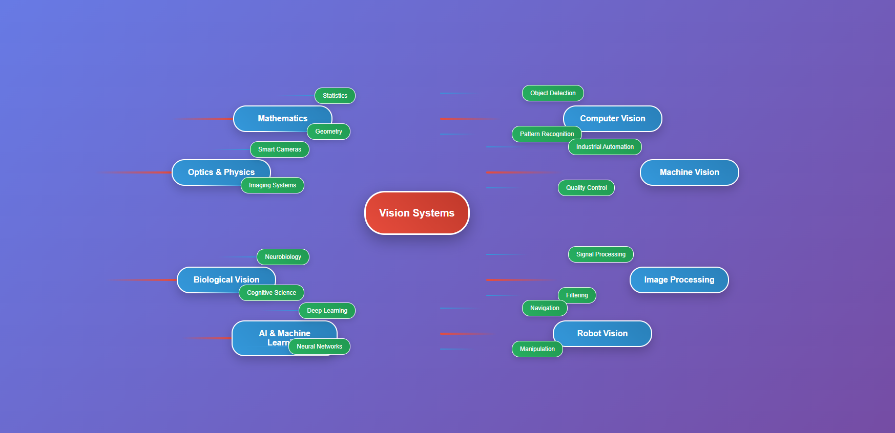

  

<h1 align="center">📷 Machine Vision Roadmap</h1>

  Your personal learning path to mastering the foundations of <strong>Computer Vision</strong>.

---

## 📚 Introduction

This roadmap is designed for anyone eager to enter the field of **Machine Vision** and understand its core foundations — from math and geometry to image processing and algorithms. 

Whether you're an AI enthusiast, a graphics engineer, or a computer vision researcher, this guide is curated to help you build a **strong theoretical base** and **hands-on intuition**.

---

## 🔢 1. Foundational Mathematics

### 📘 [Mathematics for Machine Learning](https://mml-book.github.io/)  
**Authors:** Deisenroth, Faisal, Ong

> A beautifully structured book covering Linear Algebra, Multivariate Calculus, and Probability — exactly what you need to understand the math powering computer vision models.

---

## 🧭 2. Geometry (with focus on Camera and Projective Geometry)

### 📘 Multiple View Geometry in Computer Vision  
**Authors:** Richard Hartley, Andrew Zisserman  
**📎 MIT OCW Summary & Lectures:** [Link](https://ocw.mit.edu/courses/6-869-adv-comp-vision-fall-2005/lecture-notes/)

> The **definitive textbook** for geometric vision: projective geometry, epipolar constraints, camera calibration, and multi-view reconstruction.

---

## 🎨 3. Computer Graphics

### 📘 Computer Graphics: Principles and Practice  
**Authors:** Foley, van Dam, Feiner, Hughes

### 📺 Stanford CS148 - Introduction to Computer Graphics  
[Website](https://cs148.stanford.edu/)

> Start fast with this **project-oriented course** that bridges computer graphics with vision pipelines. Great for understanding rendering, shading, transformations, and 3D perception.

---

## 🖼 4. Image Processing

### 📘 Digital Image Processing  
**Authors:** Rafael C. Gonzalez, Richard E. Woods

### 📺 MIT OCW Lecture on Image Processing  
[Link](https://ocw.mit.edu/courses/6-111-introductory-digital-systems-laboratory-spring-2006/pages/video-lectures/image-processing/)

> A **classic reference** for understanding filters, convolution, edge detection, morphological operations, and frequency-domain processing.

---

## 👁 5. Computer Vision (Core Algorithms)

### 📘 [Computer Vision: Algorithms and Applications](http://szeliski.org/Book/)  
**Author:** Richard Szeliski

> A comprehensive dive into the **core CV algorithms**: feature detection, matching, optical flow, structure from motion, and 3D reconstruction.

### 📺 Stanford CS231A - Computer Vision: From 3D Reconstruction to Recognition  
[Course Website](https://web.stanford.edu/class/cs231a/)

> A modern course with **geometry-heavy emphasis**, excellent for those wanting more than ML black boxes.

---

## 🛠️ Coming Soon

- ✅ Learning path for **Deep Learning + Vision** (e.g. CNNs, Transformers for Vision)
- ✅ Projects and hands-on notebooks
- ✅ Research paper recommendations

---

## 👤 Author

**Arioo Barzan**  
📫 [LinkedIn](https://www.linkedin.com/in/arioobarzan) | 🧠 Passionate about AI, CV, and Educational Content Creation

---

## ⭐ Star This Repository

If you find this roadmap helpful, don’t forget to ⭐ the repo and share it with others!

> "Learning vision isn't just about code — it's about **seeing** the world mathematically, geometrically, and computationally."  
> — *A roadmap by Arioo Barzan*

